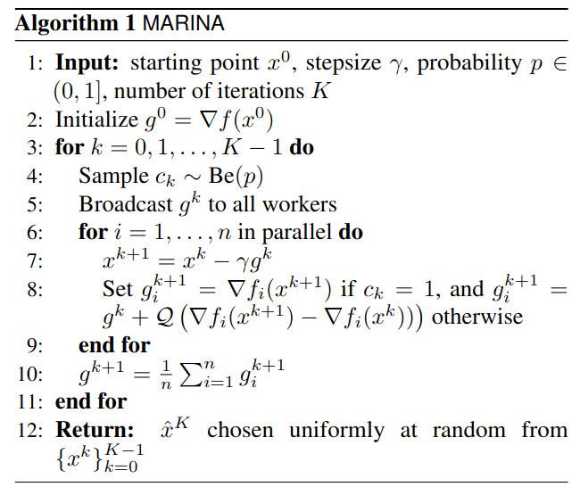
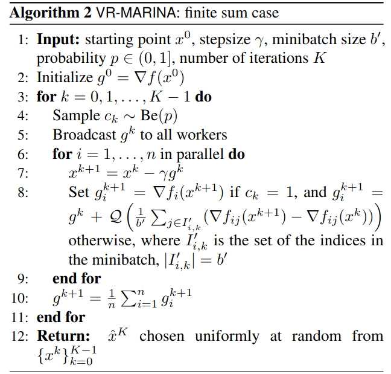
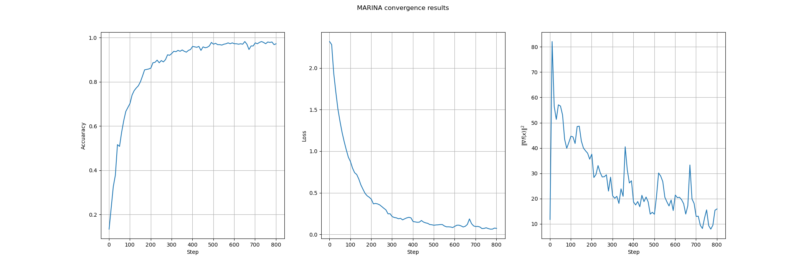
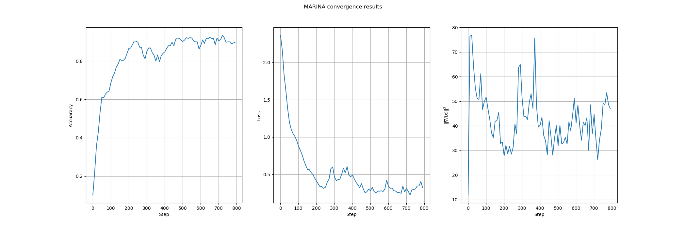
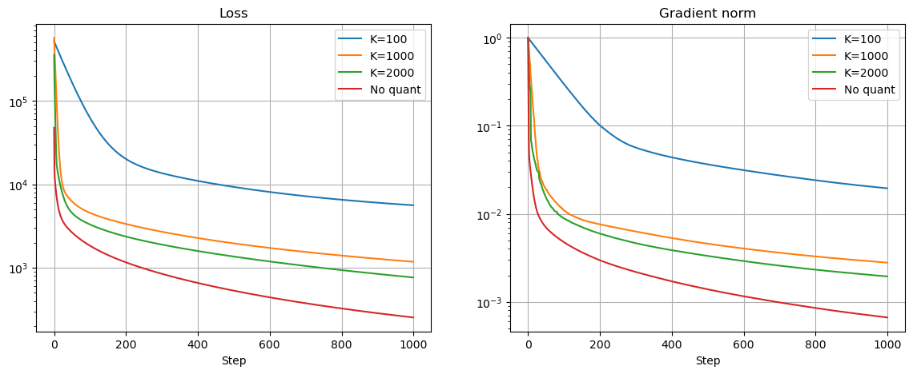

# Introduction

This repository contains the experiments and possible extensions of the paper [MARINA: Faster Non-Convex Distributed Learning with Compression](https://arxiv.org/abs/2102.07845) by Eduard Gorbunov, Konstantin Burlachenko, Zhize Li, Peter Richtárik. This repo is initially forked from the original repo, mentioned in the paper.  

# MARINA original paper idea
This paper proposes a new algorithm, which performs communication efficient distributed learning. It utilizes the compression strategy based on compression of gradient differences. And this method deals with the bottleneck of the communication in distributed learning, which is the main problem of the distributed learning.

This method aims to optimize smooth, but non-convex finite-sum problems of the following form:

$$
\min_{x \in \mathbb{R}^d} \left\{ f(x) = \frac{1}{n} \sum_{i=1}^n f_i(x) \right\}
$$

where $n$ **clients** are connected in a centralized way with a **parameter-server**, and client $i$ has an access to the local loss function $f_i$ only.

The algoithm implements the following steps:

Generalized version of the MARINA is **VR-MARINA**, which is based on the variance reduction technique. which can handle the situation when the local functions $f_i$ have either a finite-sum (each $f_i$ is an average of m functions) or an expectation form, and when it is more efficient to rely on local stochastic gradients rather than on local gradients. When compared with MARINA, VR- MARINA additionally performs local variance reduction on all nodes, progressively removing the variance coming from the stochastic approximation, leading to a better convergence rate.

VR version of the algorithm implements the following steps:

# Paper experiments reproduction

At this part of the project I reproduced the experiments from the paper. It's simple task of the image classification using the CIFAR-10 dataset, using the ResNet-18 model. 

The main difficulty of this experiment is the distributed learning setup. I used 5 workers, each of them have a ResNet-18 with it's own set of parameters. The main idea of the distributed learning is that each worker has a part of the dataset. Loss function is calculated on each worker, and then the gradients are aggregated on the parameter server. After that, the parameter server sends the updated parameters to each worker. 

As a method for gradient compression I used RandK, which is a random k-sparse compression method. It's a simple method, which randomly selects k elements from the gradient vector and sets the rest to zero. For the experiments I used $K = 10^6$, which is $0.089$ of the total number of parameters in the model. And I got the following results for the MARINA and VR-MARINA algorithms:

### For the VR-MARINA algorithm:

### For the MARINA algorithm:

As we can see, the VR-MARINA algorithm converges faster than the MARINA algorithm.

# Possible extensions

The idea of the original paper is to have part of the dataset on each worker. And the part of the dataset here means that samples of the dataset are distributed between the workers. 

And in my work I considered the case of the vertical partitioning of the dataset. It means that each worker has all the samples, but each sample has only a part of the features. And the main idea of the vertical partitioning is that each worker has a part of the features of each sample. This approach can be especially useful then we dealing with the multi-modal data, and each client server works with a different modality of the data, for which it have been pre-trained. 

### Simple example with linear model
In this case I have simple regression task:
$$
Dx = b
$$
where $D \in \mathbb{R}^{n \times d}$ is a matrix of the features, $x \in \mathbb{R}^d$ is a vector of the weights, and $b \in \mathbb{R}^n$ is a vector of the labels.

And each worker has a part of vector $x$, and a part of matrix $D$.

$$
f_i = d_ix_i
$$

Function we want to minimize is:

$$
L(f) = \|DX - b\|_2^2
$$

It's derivative *(gradient)* is:

$$
\frac{\partial L(f)}{\partial x_i} = 2d_i^T(DX - b)
$$

For gradient we need $DX$ term, which contains info from all the workers. 

$$
DX = \sum_{i = 1}^kd_ix_i
$$

And we can't calculate it on each worker, because it will be too expensive. So we need to use the compression of the gredient differences as in the original paper.

**Quantized gradient difference is:**

$$
\nabla f_i(x_i) = 2 d_i^T \left( \sum_{j = 1}^k Q \left[ d_jx_j^{k+1} - d_ix_i^{k} \right] \right)
$$

**And the update rule is:**

$$
x_i^{k+1} = x_i^k - \gamma g_i^k
$$

$$
g_i^{k+1} = 
\begin{cases}
\nabla f_i(x) & \text{if } c_k = 1\\
g_i^k +  2 d_i^T \left( \sum_{j = 1}^k Q \left[ d_jx_j^{k+1} - d_ix_i^{k} \right] \right) & \text{otherwise}
\end{cases} 
$$

#### Results

As we can see, the algorithm converges even with the compression of the gradient differences. 

### Experiments with multi-modal data and complex models
